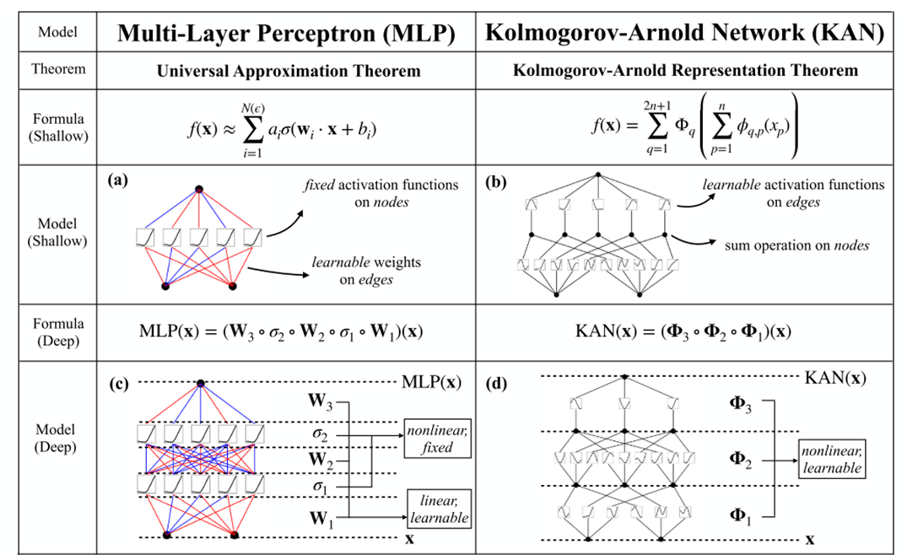
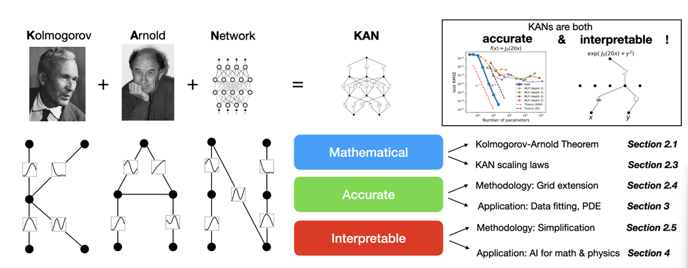
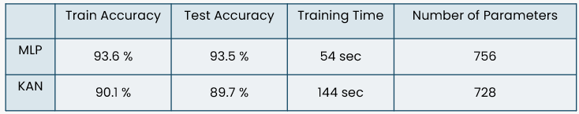
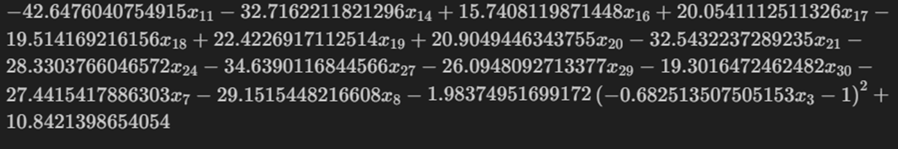
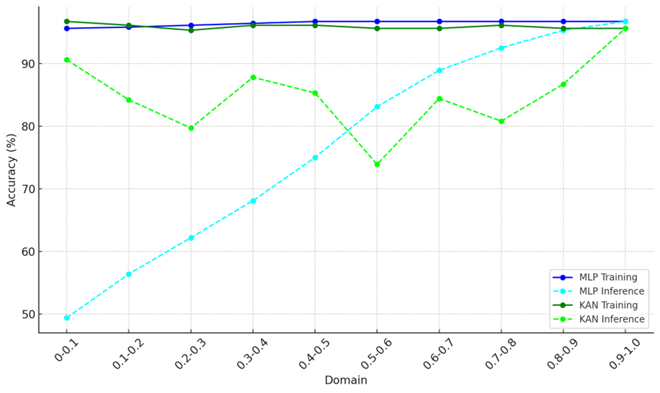
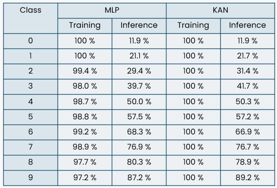
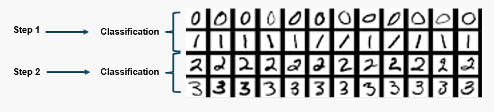
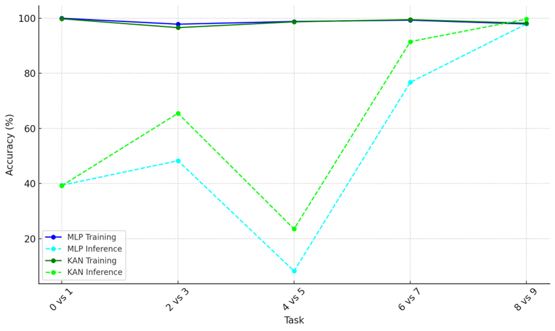

# KAN: Kolmogorov-Arnold Networks

KAN is founded on the Kolmogorov-Arnold Representation Theorem (KART), which states that if \( f \) is a multivariate continuous function defined on a bounded domain, it can be expressed as a finite composition of continuous functions of a single variable, combined using the binary operation of addition. In this image, we can see the differences between KAN and MLP.

These videos demonstrate how a Multi-Layer Perceptron (MLP) and a Kolmogorov-Arnold Networks(KAN) are trained. The weights in the MLP change during training while the KAN undergoes a 1-D B-spline update.

  <video width="45%" controls>
    <source src="video/KAN.mp4" type="video/mp4">
  </video>
  fdsfsdf
  <video width="45%" controls>
    <source src="video/MLP.mp4" type="video/mp4">
  </video>

Kolmogorov-Arnold Networks (KANs) possess unique features in terms of accuracy, interpretability, and continual learning. The original paper presents simple examples demonstrating that KANs outperform Multi-Layer Perceptrons (MLPs). Our aim is to utilize more realistic datasets to compare KANs and MLPs based on the following criteria:

1. Accuracy
2. Interpretability
3. Domain Incremental Continual Learning
4. Class Incremental Continual Learning
5. Task Incremental Continual Learning

Each of the five notebooks will focus on comparing KANs and MLPs according to the specified criteria, and will include detailed explanations for clarity. Continual learning is categorized into three different types: domain incremental continual learning, class incremental continual learning, and task incremental continual learning.

## Accuracy

In this notebook, I implement a Kolmogorov-Arnold Network (KAN) for loan approval prediction and compare its performance against a similarly structured neural network. 

* This dataset contains a larger number of entries, allowing us to assess the performance of KANs on bigger datasets. 
* The dataset is available on Kaggle at this https://www.kaggle.com/competitions/playground-series-s4e10.

**Results**

- MLPs can achieve higher accuracy when working with real datasets. 
- The biggest bottleneck of KANs lies in their slow training. 
- KANs are typically 10 times slower than MLPs with the same number of parameters.

## Interpretability
In this notebook, I implement a Kolmogorov-Arnold Network (KAN) for breast cancer prediction and compare its performance with a neural network of a similar architecture. The dataset used is from Kaggle and is available at this https://www.kaggle.com/datasets/uciml/breast-cancer-wisconsin-data.

First, I trained a Kolmogorov-Arnold Network (KAN) using a few selected features to observe the parameter updates during training. Next, I trained a small KAN with one hidden layer on the entire dataset, which exhibited strong interpretability. Finally, I trained a fully connected neural network with a comparable number of parameters. After pruning the mode, I did symbolification and created a formula for the final model.

**Results**

The results demonstrate a significant level of interpretability for this model, even when applied to large datasets.

## Domain Incremental Continual Learning

We will implement a Kolmogorov-Arnold Network (KAN) for domain incremental learning and compare it with a neural network of similar architecture. The MNIST dataset will be used to define the tasks.

In this section, we will create ten different datasets, each with a unique data distribution. The first dataset will contain values ranging from 0 to 0.1, while the second dataset will cover values from 0.1 to 0.2. This pattern will continue for all ten datasets. 

We will sequentially train models and Finally, we will compare the results obtained from both models.

**Results**

In the context of "Domain Incremental Continual Learning, KANs perform better than Multi-Layer Perceptrons (MLPs).

## Class Incremental Continual Learning

We are implementing a Kolmogorov-Arnold Network (KAN) for class incremental learning and will compare it against a neural network with a similar architecture. The MNIST dataset will be used to define our tasks.

In this section, we will create ten different datasets, each featuring a unique data distribution. Each dataset will include a specific category of data along with a small portion of previously seen data. We will sequentially train two models: a KAN model and a Multi-Layer Perceptron (MLP) model. Finally, we will compare the results obtained from both models.

**Results**

The KAN and MLP models are not effective in the context of class incremental learning.

## Task Incremental Continual Learning

Implement a Kolmogorov-Arnold Network (KAN) for task incremental learning. Compare KAN with a similarly architected neural network. Each task involves binary classification between two digits using the MNIST dataset.

**Results**

The KAN and MLP models are not effective in the context of task incremental learning.

## References

- [Liu, Z., Wang, Y., Vaidya, S., Ruehle, F., Halverson, J., Soljačić, M., Hou, T. Y., & Tegmark, M. (2024b). KAN: Kolmogorov-Arnold Networks. arXiv (Cornell University). https://doi.org/10.48550/arxiv.2404.19756
- https://neptune.ai/blog/continual-learning-methods-and-application
- https://www.kaggle.com/datasets/uciml/breast-cancer-wisconsin-data

